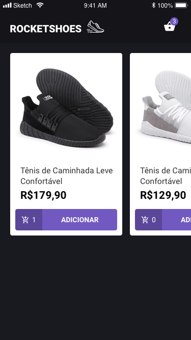

## Projeto

Mobile de um e-commerce de calçados utilizando React Native. 

Demo 

Home 

Cart 

## Como instalar

Baixe as dependências do projeto:
### `yarn`

Esse projeto utiliza o json-server, instale globalmente:
### `npm -g install json-server`

Rode o json-server na porta 3333:
### `json-server server.json -p 3333`

Caso for utilizar o dispositivo conectado na USB, verifique se está disponível:
### `adb devices`

Instale o APK no celular ou emulador
### `react-native run-android`

Se o Metro Bundler não iniciar, inicie manualmente:
### `react-native start --reset-cache`

Se não conseguir capturar as informaçes da API:
### `adb reverse tcp:3333 tcp:3333`
